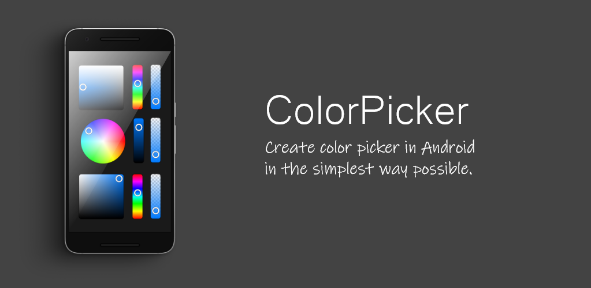

# ColorPicker for Android
Simple library for creating fully modular color pickers written in Kotlin

<p align="center">
    
</p>
 
## About
Kotlin Library used for creating custom color pickers by adding different modules that combined all together form color picker.
To learn more about the library you can check the [Wiki](https://github.com/slaviboy/ColorPickerKotlin/wiki) page
 
[](http://developer.android.com/index.html)
[](https://android-arsenal.com/api?level=21)
[](https://github.com/slaviboy/ColorPickerKotlin/releases/tag/v.0.1.0)

## Add to your project
Add the jitpack maven repository
```
allprojects {
  repositories {
    ...
    maven { url 'https://jitpack.io' }
  }
}
``` 
Add the dependency
```
dependencies {
  implementation 'com.github.slaviboy:ColorPickerKotlin:v0.1.0'
}
```
 
### Add Components
Here is example on how to include color picker components in your layout, in this particular example rectangular color window **RectangularSV** is used together with simple EditText that holds information about the RGB(Red, Green, Blue) values, for the selected color.
```xml
<com.slaviboy.colorpicker.module.rectangular.RectangularSV
    android:id="@+id/rectangularSV"
    android:layout_width="200dp"
    android:layout_height="200dp"
    app:corner_radius="10dp"
    app:layout_constraintBottom_toTopOf="@+id/label"
    app:layout_constraintHorizontal_chainStyle="packed"
    app:layout_constraintLeft_toLeftOf="parent"
    app:layout_constraintRight_toRightOf="parent"
    app:layout_constraintTop_toTopOf="parent"
    app:layout_constraintVertical_chainStyle="packed"
    app:selector_radius="0.06vh"
    app:selector_stroke_width="0.03vh" />

<TextView
    android:id="@+id/label"
    android:layout_width="wrap_content"
    android:layout_height="wrap_content"
    android:text="RGB"
    app:layout_constraintBottom_toBottomOf="parent"
    app:layout_constraintEnd_toStartOf="@+id/text"
    app:layout_constraintHorizontal_chainStyle="packed"
    app:layout_constraintStart_toStartOf="parent"
    app:layout_constraintTop_toBottomOf="@+id/rectangularSV"
    app:layout_constraintVertical_chainStyle="packed" />

<EditText
    android:id="@+id/text"
    android:layout_width="wrap_content"
    android:layout_height="wrap_content"
    app:layout_constraintBottom_toBottomOf="@+id/label"
    app:layout_constraintEnd_toEndOf="parent"
    app:layout_constraintStart_toEndOf="@+id/label"
    app:layout_constraintTop_toTopOf="@+id/label" />
```

### Set Updater and ColorConverter
In your activity you need to associate the color components with certain [ColorConverter](https://github.com/slaviboy/ColorPickerKotlin/wiki#ColorConverter) and [Updater](https://github.com/slaviboy/ColorPickerKotlin/wiki#Updater).

ColorConverter class is used for conversion of the current selected color into different color models. Those color model values can be used by text views to display the currently selected color.The class has methods that lets you get the current selected color in different color model formats. 

Update class is responsible for updating the content of all attached color pickers and text views responsively, so the change in one view will trigger change in the other color picker components. That way you can attach multiple color pickers and separate components without the need of manually changing each one. If you want to create custom color picker with your own custom components combined in separate xml file, you can check the tutorial section on the [Wiki](https://github.com/slaviboy/ColorPickerKotlin/wiki#tutorial-creating-custom-color-picker) page.

```kotlin

// get color picker components by id
val rectangularSV: RectangularSV = findViewById(R.id.rectangularSV)
val editText: EditText = findViewById(R.id.text);

// create color converter with selected color: RGBA(160, 73, 184, 50)
val colorConverter: ColorConverter = ColorConverter(160, 73, 184, 50)

// create updater, that will update all components
val updater: Updater = Updater(colorConverter)

// attach the components
updater.attachColorWindows(rectangularSV)
updater.attachTextView(editText, Updater.TYPE_RGB)
```

### Listen for changes
You can attach listener that will trigger two methods when the user selects new color, from a certain component. The first event is for detecting TextViews value changes, and the other one is for detecting changes in Color Windows.
```java
updater.setOnUpdateListener(object : OnUpdateListener {

    override fun onTextViewUpdate(textView: TextView) {
        // triggered when user changes text view value
    }
            
    override fun onColorWindowUpdate(colorWindow: Base) {
        // triggered when user changes color window value
    }
})
```
